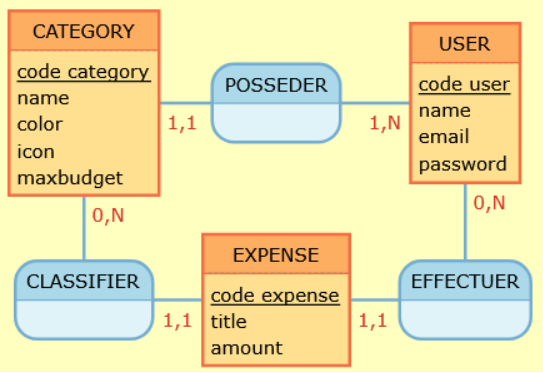
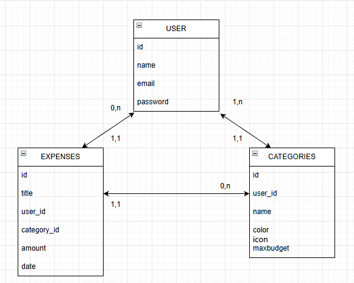

## MCD

- USER (name, email, password)  
- EXPENSE (title, amount, date)  
- CATEGORY (name, color, icon, max-budget) 

-- un USER a (0, N) EXPENSE  
-- une EXPENSE a (1, 1) USER  
-- une CATEGORY a (0, N) EXPENSE  
-- une EXPENSE a (1,1) CATEGORY  
-- un USER a (1,N) CATEGORY  
-- une CATEGORY a (1,1) USER  

Attention !  
-> Une catégorie par défaut sera créée à l’inscription d’un user  
-> Un user ne peut pas supprimer la dernière catégorie !

## MLD
- USER (id, name, email, password)  
- EXPENSE (id, title, amount, date, #category_id, #user_id)  
- CATEGORY (id, name, color, icon, #user_id, max-budget)  

## Dictionnaire de données

**User**
| Champ    | Description        | Type    | Unique? | Exemple                                                                                                                |
|----------|--------------------|---------|---------|------------------------------------------------------------------------------------------------------------------------|
| id       | Clé primaire       | Integer | oui     | 3                                                                                                                      |
| name     | Nom d'utilisateur  | String  | non     | Jean-Michel                                                                                                            |
| email    | Email de connexion | String  | oui     | jean.michel@gmail.com                                                                                                  |
| password | Mot de passe hashé | String  | non     | `$argon2id$v=19$m=19456,t=2,p=1$NDhmYThhY2ZiMzc4ZTc3MTMxMTQzMThjODVmNDgyZjg$4RLiOyhRMF3MzGj9pc1pSejO9VZN/qIor3dByEHM0Ds` |

**Expense**
| Champ       | Description                        | Type    | Unique? | Exemple             |
|-------------|------------------------------------|---------|---------|---------------------|
| id          | Clé primaire                       | Integer | oui     | 2                   |
| title       | Nom de la dépense                  | String  | non     | Livres de cours     |
| amount      | Montant de la dépense              | Number  | non     | 40.5                |
| date        | Date de la dépense                 | Date    | non     | 13/01/2026 14:22:13 |
| category_id | Clé étrangère de la table category | Integer | non     | 4                   |
| user_id     | Clé étrangère de la table user     | Integer | non     | 5                   |

**Category**
| Champ      | Description                      | Type    | Unique? | Exemple      |
|------------|----------------------------------|---------|---------|--------------|
| id         | Clé primaire                     | Integer | oui     | 3            |
| name       | Nom d'une catégorie              | String  | oui     | Alimentation |
| color      | Couleur                          | String  | non     | #FF0000      |
| icon      | Lien de l'icone                          | String  | non     | https://www.image.com/icone.png      |
| user_id    | Clé étrangère de la table user   | Integer | non     | 2            |
| max-budget | Budget maximum pour la catégorie | Number  | non     | 1050         |
