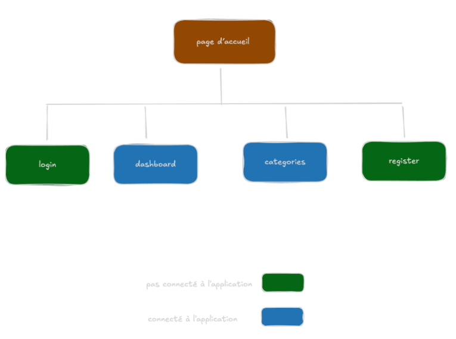

## Présentation
Le but du projet est la création d’une application web de gestion de finance personnelle pour une entreprise fictive, à destination de divers profils de particuliers/travailleurs indépendants (étudiants, actifs, couples et familles, auto entrepreneur etc) souhaitant suivre, catégoriser et anticiper les dépenses mensuelles.

## Définition des besoins et des objectifs
Dans un contexte économique où la gestion des dépenses personnels représente un défi quotidien pour de nombreux particuliers, l’application vise à apporter des solutions pratiques pour répondre à ce besoin de contrôle de son budget.
L’application LaPince répond à ce besoin en permettant aux utilisateurs de suivre et catégoriser leurs dépenses, de définir des budgets par catégorie et de visualiser facilement leur situation financière, afin d’anticiper les dépassements via des alertes et de mieux maîtriser leur budget au quotidien.
		
## MVP
- Système d'authentification : inscription, connexion.
- Suivi des dépenses : ajout, modification, suppression de dépenses.
- Création de budgets : définition de budgets par catégorie (nourriture, factures, sorties, etc.) avec suivi du respect des limites.
- Alertes de dépenses : notifications lorsque les dépenses approchent ou dépassent les limites fixées.

## Les évolutions potentielles
- Filtres pour le tableau des dépenses (par catégorie, par montant etc)
- Recherche de dépenses par titre
- Séparer les dépenses par compte bancaire
- Tableau de bord : visualisation graphique de la situation financière globale (dépenses, budget).
- Gestion de groupes d’utilisateurs : pour gérer un budget à plusieurs (familles, collocation, etc.).
- Planification de l'épargne : définition d'objectifs d'épargne (vacances, gros achat etc) et suivi de la progression.console.log()
- Génération de rapports personnalisés : dépenses par période, catégorie, etc.
- Basculer entre le mode clair et mode Dark 
- Confirmation de mot de passe à l'inscription

## Liste des technologies

**Frontend**
| Techno | Version | Pourquoi ce choix ?                                                                                                                                                                           |
|--------|---------|-----------------------------------------------------------------------------------------------------------------------------------------------------------------------------------------------|
| Vite   | 7.3.1   | Car il offre un démarrage rapide du projet, un rechargement instantané lors du développement et une configuration simple. Permettant ainsi de gagner du temps et d’améliorer la productivité. |
| Svelte | 5.46.3  | Permet de créer des interfaces performantes, légères et faciles à maintenir.                                                                                                                  |

**Backend**
| Techno     | Version | Pourquoi ce choix ?                                                                                                              |
|------------|---------|----------------------------------------------------------------------------------------------------------------------------------|
| Node.js    | 22.20.0 | Pour créer le serveur de l’application et gérer les données des utilisateurs rapidement avec JS.                                 |
| Express    | 5.2.1   | Est utilisé pour faciliter la création des routes et gérer les requêtes du serveur de manière simple et rapide                   |
| Sequelize  | 6.37.7  | Est utilisé pour communiquer avec la base de données et manipuler les données sans écrire                                        |
| PostGreSQL | 17.7    | Est utilisé comme base de données pour stocker et gérer toutes les informations de l’application de manière sécurisée et fiable. |

## Public visé par l’application 

- Étudiants soucieux de leur dépense avec un budget réduit.
- Actifs qui veulent garder la main sur leurs dépenses.
- Familles qui ont besoin d’une vue d’ensemble sur le grand nombre de dépenses qu’elles peuvent avoir.
- Travailleurs indépendants qui ont également besoin d’une vue d’ensemble en temps réel sur un grand nombre de dépenses pour éviter les problèmes de trésoreries.

## Les navigateurs compatibles 
- Opera 126
- Safari 18.6 
- Firefox 147-149
- Chrome 144-146

## Arborescence de l’application

## Endpoints API

| Verbe  | Chemin          | Description                                                     |
|--------|-----------------|-----------------------------------------------------------------|
| POST   | /auth/login     | Requête de connexion qui renvois un JWT si identifiants valides |
| POST   | /auth/register  | Requête d'inscription                                           |
| POST   | /auth/logout    | Requête de deconnexion                                          |
| GET    | /auth/me        | Requête pour récupérer l'id et le nom du user connecté          |
| GET    | /categories/:id   | Requête pour récupérer une catégorie                            |
| GET    | /categories       | Requête pour récupérer les catégories                           |
| POST   | /categories       | Requête pour ajouter une catégorie                              |
| PATCH  | /categories/:id   | Requête pour modifier une catégorie                             |
| DELETE | /categories/:id   | Requête pour supprimer une catégorie                            |
| GET    | /expenses/:id    | Requête pour récupérer une dépense                              |
| GET    | /expenses        | Requête pour récupérer les dépenses                             |
| GET    | /expenses?month= | Requête pour récupérer les dépenses d'un mois                   |
| POST   | /expenses        | Requête pour ajouter une dépense                                |
| PATCH  | /expenses/:id    | Requête pour modifier une dépense
| DELETE  | /expenses/:id    | Requête pour supprimer une dépense                                 |

## Users story

| # | En tant que | Je souhaite | Afin de | Sprint |
|---| --- | --- | --- | --- |
| 1 | Visiteur | Une page d’accueil | Présenter les fonctionnalités et accéder aux pages de login/register | 1 |
| 2 | Visiteur | Une page d’inscription | … | 1 |
| 3 | Visiteur | Une page de connexion | … | 1 |
| 4 | User | Une page des dépenses  | Consulter ses dépenses (+filtre) | 1-2 |
| 5 | User | Une page de catégories  | Définir des postes de dépenses et budgets associés | 1-2 |
| 6 | User | Des alertes si budget total max proche ou dépassé | … | 2 |
| 7 | User | Des alertes si budget max d’une catégorie proche ou dépassé | … | 2 |
| 8 | User | Des alertes si budget total max proche ou dépassé | … | 2 |
| 9 | User | Une page des dépenses  | Ajouter, modifier, supprimer une dépense | 2 |

## Rôles de chacun
Fabrice : Lead Dev Front
Samira : Dev Front & Product Owner
Lucas : Lead Dev Back & Git-master
Najat : Dev Back
Nassim : Dev Back & Scrum Master
